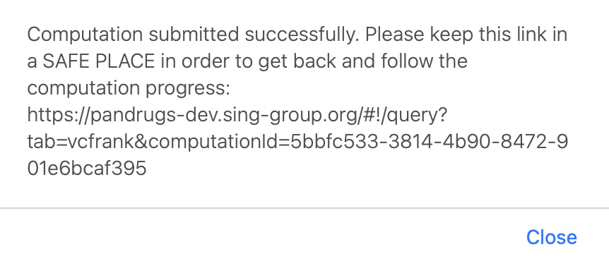
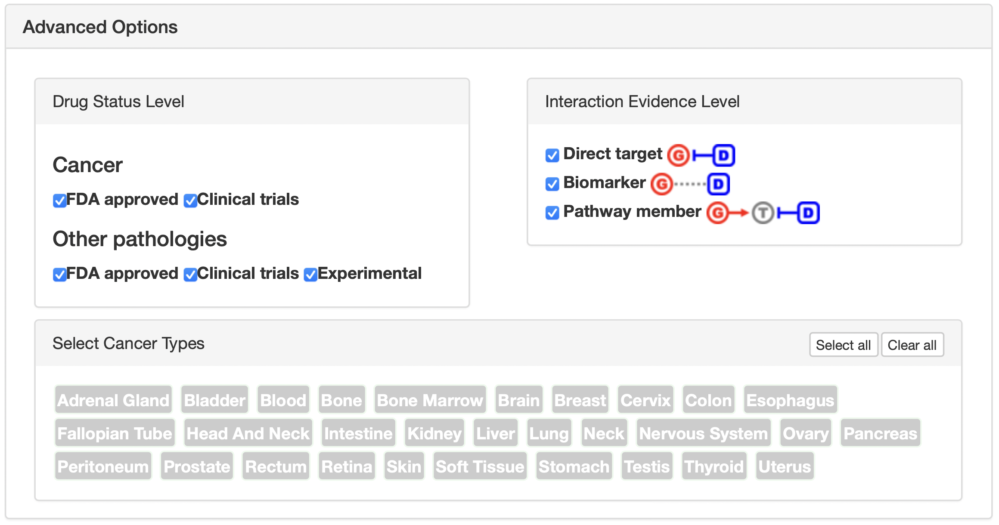
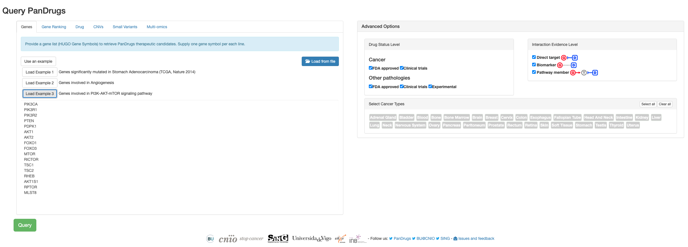
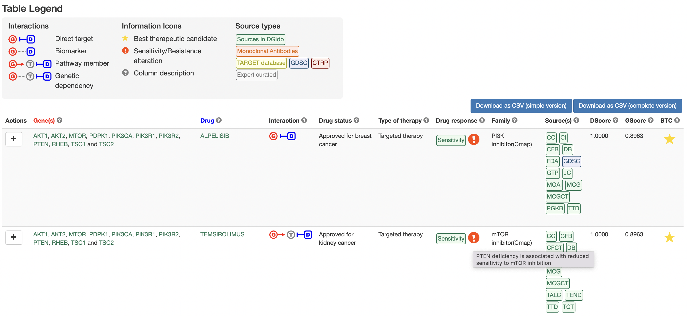
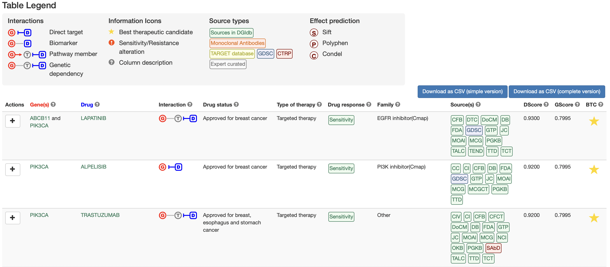

# PanDrugs Help

1. [QUERY OPTIONS](#/help#query-options)
  1. [Genes query](#/help#genes-query)
  2. [Gene ranking query](#/help#gene-ranking-query)
  3. [Drugs query](#/help#drugs-query)
  4. [VCF (Genomic Variant)](#/help#vcf)

2. [ADVANCED OPTIONS](#/help#advanced-options)
  1. [Drug status level](#/help#drugs-status-level)
  2. [Interaction evidence level](#/help#interaction-evidence-level)
  3. [Select cancer type](#/help#select-cancer-type)

3. [GScore AND DScore CONCEPT AND CALCULATION](#/help#gscore-and-dscore-concept-and-calculation)

4. [OUTPUT FOR GENES, GENE RANK AND VCF (GENOMIC VARIANTS)](#/help#output-for-genes-gene-rank-and-vcf)
  1. [Charts](#/help#drugs-status-level)
    1. [Plot-chart](#/help#plot-chart)
    2. [Pie-charts](#/help#pie-charts)
  2. [Summary table](#/help#summary-table)

5. [OUTPUT FOR DRUGS QUERY](#/help#output-for-drugs-query)

6. [EXAMPLES](#/help#examples)
  1. [Genes query](#/help#examples-genes-query)
  2. [Gene ranking query](#/help#examples-gene-ranking-query)
  3. [Drugs query](#/help#examples-drugs-query)
  4. [VCF (Genomic Variant)](#/help#examples-vcf)

7. [DATABASE VERSIONS FOR VCF ANNOTATION](#/help#database-versions-for-vcf-annotation)

## 1. Query Options
There are three possible input options to obtain a **list of therapies according to an individualized genetic profile**:

- A list of gene symbols.
- A ranked list of gene symbols.
- A vcf file containing a set of variants corresponding to the GRCh37/HG19 assembly of the human genome.

Another possibility is to query the database to see **which genes are associated with a particular drug in the database**.

### 1.1 Genes query
In this modality, the input is a **set of genes that must be introduced with the corresponding Gene Symbol**. Each gene name must be in a different line.

Based on this gene list, the potential therapies are calculated taking into account the global set of genes. That is, if there are predicted resistance responses to a drug based on a particular gene, although another gene indicates sensitivity, that drug will be kept down in the list (in the resistance region).

### 1.2 Gene ranking query
With this search option, it is possible to provide a **ranked list of genes in the RNK (Ranked List) file format**.

This file must be uploaded and must contain an ordered gene list with two tab delimited columns. In the first column, we have the HUGO Gene Symbols and the second column contains the corresponding weight. This weight will be normalized to a range between 0-1.

### 1.3 Drugs query
In this query option, **a particular drug** can be selected in order to explore the connection of the compound with the genes in the database. Drugs can be searched in the database by the source name, the standardized drug name or the preferred shown name. When typing the name, the suggestions for the drug are shown.

### 1.4 VCF
In this search option, a **vcf file** must be provided. In this file, the genomic coordinates must be expressed in the HG19 assembly of the human genome.

To create a new analysis click on New variants analysis... button, select a vcf file, select a name for the job and click on Submit VCF file button.

A message indicating that computations has been successfully submitted appears and a new analysis with an associated progress bar appears in the variant analysis box.

As the computation progress, the completion of the different steps is indicated in the progress bar.

During this process, the VCF file is annotated using the Variant effect Predictor of Ensembl and additional databases. A variant score is the computed for each variant and a set of genes with relevant consequences and the highest variant score is created. This highest variant score is the final GScore.

Finally, when the job is entirely done, it can be selected in order to query PanDrugs database and retrieve the suggested treatments according to the provided profile.

## 2. Advanced Options

For the queries based on genes (Genes, Gene Ranking and VCF), the query can be modulated using the panel of advanced options:

## 2.1 Drug status level

Shows therapeutics options where the drugs are in the specific approval status selected.

**Cancer:**

- **FDA approved:** FDA approved drugs used in cancer treatment.
- **Clinical trials:** Drugs in clinical trials for being used in cancer treatment.

**Other pathologies:**

- **FDA approved:** FDA approved drugs for conditions or pathologies different from cancer.
- **Clinical trials:** Drugs in clinical trials used in conditions or pathologies different from cancer.
- **Experimental:** Compounds in pre-clinical phase.

By default, all the options appear selected and the returned results will be all the existent.

## 2.2 Interaction evidence level

Shows therapeutic options where the gene in the drug-gene association has the selected interaction with the drug.

**Target:** We consider a gene as a target when it contributes to a disease phenotype and can be targeted directly by a drug. The search will return this type of drug-gene interactions.

**Marker:** We consider a gene as a marker when its genetic status is associated with a drug response by clinical or pre-clinical evidences. The search will return this type of drug-gene interaction.

By default, all the options appear selected and the returned results will be all the existent.

## 2.3 Select cancer type

For the approved drugs in cancer, it is also indicated the tumor type or tumor types for what they are prescribed. Selecting one or more available cancer categories, only the approved drugs indicated for the selected tumor types will be shown. Additionally, drugs in clinical trials or experimental drugs linked to the genes will be provided.

By default, all the cancer types are selected.

## 3. GScore and DScore concept and calculation

The Gene Score (GScore) measures the biological relevance of the gene in the tumoral process. It ranges from 0 to 1.

The Drug Score (DScore) measures the suitability of the drug, according to the genomic profile. It goes from -1 to 1 with the negative values corresponding to resistance and positive values corresponding to sensitivity.

**GScore calculation**

When the input is a **ranked gene list** where the ranking is based on some experimental results, as, for example, data originating from differential expression studies, the introduced values are normalized to the 0-1 scale.

If the input consists of a **non ranked list of genes**, the GScore is calculated according to the relevance of that gene in carcinogenesis. To perform this calculation we consider three components: the frequency at which the gene appears in different tumors, the probability of being a driver and the gene essentiality based on RNA silencing studies. Each of these components has an associated weight that is modulated depending on the correlation degree with the tumoral process that their categories establish.

When the input is a **vcf file**, the GScore is computed taking into account the provided information by the variants located in each gene. Variants are annotated using the annotations and prediction provided by the Variant Effect Predictor of Ensembl and other additional sources. Using the consequence indicated by VEP we filter the variants, keeping only those with an important impact in the transcriptional process (transcript_ablation, splice_donor_variant, splice_acceptor_variant, stop_gained, frameshift_variant, stop_lost, start_lost, transcript_amplification, inframe_insertion, inframe_deletion, missense_variant, protein_altering_variant, splice_region_variant, incomplete_terminal_codon_variant and stop_retained_variant). The score for each variant (called VScore) is computed taking into account a set of features from these annotations. Once the VScore has been established, between the VScores of a particular gene, we select the highest and establish it as the GScore in the principal transcripts.

**DScore calculation**

We have a pre-computed DScore in the database. It is based on each single drug-gene relation. In its calculation we first take into account the use of the drug in cancer, then the approval status of the drug and finally the definition of the gene as a target or marker in the relation with the drug. Experimental compounds have a different score assignation, but they rank below drugs in another status, giving more relevance to target than to marker genes.

During the assignation process the drug score is readjusted to take into account the information provided by the combination of all input data. We define a gene factor, which reflects the number of genes in the input that points to a particular compound and a source factor that reflects the number of expert curated sources that support a particular drug-gene interaction. Indirect assignations are penalized with respect to direct ones unless a marker evidence supports the association.

Experimental compounds maintain the pre-computed DScore only penalizing indirect cases.

In the case one drug has a sensitivity response due to one gene, but a resistance response due to another, the drug assignation is updated as resistance and the score is turned into negative.

## 4. Output for genes, gene rank and VCF (Genomic Variants)

Once the query has been launched, some summary charts and a table with the results for the therapeutic assignations appear.

## 4.1 Charts

## 4.1.1 Plot-chart

In this plot-chart the drug assignations are drawn where each drug is represented by a bubble.

In the X axis the Drug Score for each of the drugs is indicated and in the Y axis the Gene Score is represented.

Positive values of Drug Score correspond to sensitivity assignations according to the introduced criteria and negative values for the Drug Score represent resistance assignations. The size of the bubble is proportional to a gene score/drug score index, and the color refers to the approval status of the drug. Values above 0.7 for the Drug Score and 0.6 for the Gene Score establish the Best Candidates area shaded in green.

This plot allows the zoom option and can be printed or downloaded in different formats (png, jpeg, pdf, svg).

## 4.1.2 Pie-charts

**Drugs by approval status**

This plot shows the percentage of suggested drugs in each of the approval status categories (Approved, Clinical Trials or Experimental).

**Drugs by family**

This plot shows the family categories to which the assigned drugs belong.

These two plots can also be printed or downloaded in different formats (png, jpeg, pdf, svg).

## 4.2 Summary table

It is sortable and downloadable in csv format. In this table, we have the different therapeutic options sorted by default by the (DScore) Drug Score and the (GScore) Gene Score. Each row shows a compound, where those representing the BEST Candidates are highlighted in green. It has the following columns:

**1. Gene(s):** the gene(s) from the input list with a match in the database and related to the proposed therapy. Each gene is linked to the gene detailed information at NCBI.

**2. Drug:** name for the compound. Each drug is linked to detailed information in PubChem.

**3. Family:** category of drugs to which the compound belongs. It is based on the target-based classification of drugs provided by KEGG.

**4. Source(s):** Source where the drug-gene(s) interaction come from. Each source name links to the resource from where the drug-gene info was obtained. Sources are:

**5. Drug status:** approval status of the drug and the cancer prescription for the approved ones.

**6. Type of therapy:** type of therapy for the approved drugs in cancer. The possible options are:

- **Targeted therapy:** Drugs that precisely identify and attack cancer cells.
- **Chemotherapy:** Drugs that destroy cells that are actively growing.
- **Immunotherapy:** Drugs that boost body's own immune system to fight the disease.
- **Antihormone therapy:** Suppression of certain hormones that can prompt or help in the tumor growth.
- **Photodynamic therapy:** Use of special drugs, called photosensitizing agents, along     with light to kill cancer cells.

**7. Interaction:** type of relation between the genes and the drugs. The relation corresponding to the one with the highest drug and gene score is shown. Options are:

- **Direct:** the altered gene is the target or the biomarker of the drug

  - Target 
  - Marker 

- **Indirect:** the drug has as a target a gene related to the altered one

  

**8. DScore:** score for the drug based on approval status, use in cancer, drug-target relation, the number of associated genes and curation level of the sources. The highest Drug Score for each of the drug-gene associations is shown.

If the search is for a drug, this score is a pre-calculated value based on the approval status, use in cancer and drug-target relation.

**9. GScore:** score for the gene. This score varies depending on the query option:

- **Ranked list of genes:** the score will be the provided in the second column normalized to a 0-1 scale.

- **List of genes:** the score is computed according to the relevance in carcinogenesis and an essentiality score based on RNA silencing experiments in cancer cell lines.

- **vcf file:** a score for each of the variants is calculated based on different provided annotations. The gene score for the gene will be the highest score among the variants present in the gene.

- **Drug query:** the score is computed according to the relevance in carcinogenesis and an essentiality score based on RNA silencing experiments in cancer cell lines.

In each row, the highest Gene Score for each of the drug-gene associations with the highest Drug Score is shown.

Each of the rows has additional information that can be expanded clicking on the plus button. When expanding the information, each of the drug-gene interactions involved in the drug assignation are explained. A section with additional information is shown for each of them:

- A sentence explaining the association between the drug and the gene.

- The gene name linked to the corresponding information in NCBI.

- The sensitivity/resistance response based on the gene alteration.

- Alteration: the alteration type that drives the sensitivity/resistance response.

- A link to PubMed and ClinicalTrials.gov for additional information regarding the drug-gene association.

Also, the family, source(s), Interaction, Drug Score and Gene Score for each of the drug-gene interactions summarized in the row are displayed.

## 5. Output for drugs query

In case of consulting the database to extract the genes related to a particular drug, the result consists in a summary table with the same format as for the other queries.

In this case, each of the rows represents each of the genes associated with the input drug. The DScore is the pre-calculated drug score for each drug-gene interaction in the database. The GScore is computed according to the relevance in carcinogenesis and an essentiality score based on RNA silencing experiments in cancer cell lines.

See [Summary table](#/help#summary-table) for further information

## 6. Examples

## 6.1. Genes query

[Load PI3K-AKT-mTOR signaling pathway example](#)

Clicking on Query button the results are calculated.

**Output**

In the results page a section with the different graphs and the summary table appears (see [OUTPUT FOR GENES, GENE RANK AND VCF (GENOMIC VARIANTS)](#/help#output-for-genes-gene-rank-and-vcf) section for the explanation about the components)

[See output of a Gene Query](#/query?example=genes)

Among the best candidates PanDrugs suggest Everolimus, Temsirolimus of Tamoxifen.

Everolimus suggestion is based on target (MTOR) inhibition and biomarkers (TSC1, AKT1, PIK3CA, PTEN, TSC2 and AKT2) of the response. The MTOR inhibition is strengthened in this case due to besides the fact that this gene is mutated it is also downstream to affected genes in the pathway.

Another possibility is the use of Temsirolimus, another serine/threonine protein kinase inhibitor with different targets among the genes in the list (MTOR, RPTOR - based on direct and indirect evidence -) and PTEN, PIK3CA, TSC2 and TSC1 markers of response.

Tamoxifen is another possible indirect therapy based on the inhibition of PRKCA protein downstream of the altered genes MLST8, MTOR, PDPK1, RHEB, RICTOR and TSC2.

## 6.2. Gene ranking query 

[Load example for Melanoma patient BRAF mutant from TCGA](#)

Clicking on Query button the results are calculated.

**Output**

In the results page a section with the different graphs and the summary table appears (see [OUTPUT FOR GENES, GENE RANK AND VCF (GENOMIC VARIANTS)](#/help#output-for-genes-gene-rank-and-vcf) section for the explanation about the components)

Output is retrieved in the same way and the results are interpreted as just as in Genes query.

In the particular case of this example, we do not see any result showed in the Best Candidate area as top up-regulated genes do not have any therapy in higher approval status.

But if we look down on the list, some candidates proposed by PanDrugs as a treatment are Ponatinib, Dasatinib, Imatinib, Palbociclib or Bosutinib. All based on marker and indirect evidences as shown in the detailed breakdown.

Also, other treatments based on the direct targeting of some dysregulated genes are suggested, as Etoposide, Gemcitabine or Erlotinib.

## 6.3. Drugs query

[Load Ponatinib example (Approved drug for targeted therapy in blood cancer)](#)

Clicking on Query button the results are calculated.

**Output**

In the results page a section with the different graphs and the summary table appears (see [Output for drugs query](#/help#output-for-drugs-query) section for the explanation about the components)

[See output of a Drugs Query](#/query?example=drugs)

Genes in three different levels of association are returned as a result for this query. Genes that are targeted by this drug are ABL1, FGFR3, FGFR2 or RET. Other genes are biomarkers of response, as for example BRAF which mutations are associated with sensitivity to Ponatinib or CCND2, which mutations are associated with resistance to Ponatinib according to GDSC studies. Also, some genes are with this drug in an indirect way, as happens with KDR. Ponatinib targets SRC, that is a gene downstream KDR. If some alterations occur in KDR, this drug could be used to block this pathway, targeting SRC.

## 6.4. VCF (Genomic Variant)

[Load example for melanoma patient BRAF mutant from TCGA](#)

Clicking on Query button the results are calculated.

**Output**

In the results page a section with the different graphs and the summary table appears (see [OUTPUT FOR GENES, GENE RANK AND VCF (GENOMIC VARIANTS)](#/help#output-for-genes-gene-rank-and-vcf) section for the explanation about the components)

[See output of a VCF (Genomic Variant) Query](#/query?example=vcf)

Among the suggested treatments, some approved drugs for this cancer type (skin cancer) are provided as Dabrafenib or Vemurafenib, that have as targets BRAF and NTRK1.

Based on these same genes, but on a marker base, TRAMETINIB and COBIMETINIB are suggested as treatments. BRAF and NTRK1 alterations are related to a sensitivity response to these drugs.

In a repurposing way, the approved drugs for blood cancer DASATINIB or PONATINIB are also indicated due to the alterations in BRAF, COL1A1, NTRK1 and PTEN, biomarkers of sensitivity to these compounds.

## 7. Database versions for VCF annotation 

**Variant Effect Predictor** Release 85

**COSMIC** Release v79 for HG19 assembly

**Pfam** 30.0

**UniProt** Release 2016_10

**InterPro** 60.0

**ClinVar** 1.39

**Cancer Gene Census for Cosmic** v79

**APPRIS** (gencode19/ensembl74)

**KEGG** accessed 18/11/2016
